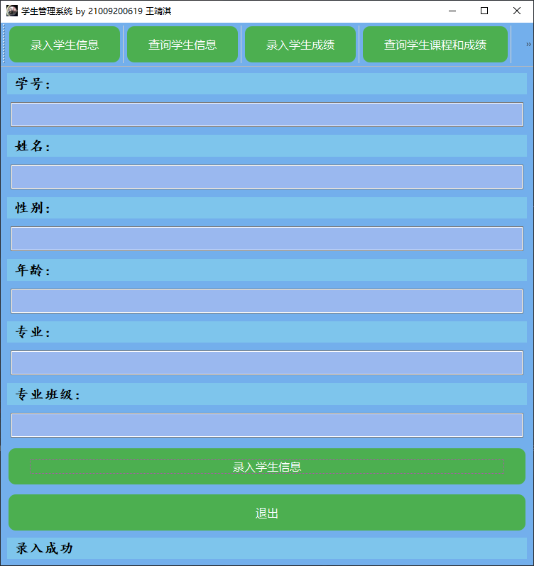

# 实验名：学籍管理系统

## 一.实验要求：

1.学校有若干**专业**，每个专业每年招若干个**班**，每个班有若干**学生**

2.每个专业有自己的**教学计划**，规定了该专业相关课程的性质（必修或选修）以及授课学期；例如，数据库课程对计算机专业为必修、在大三上学期，但对数学专业可能为选修、在大三下学期，而中文专业可能不学这门课

3.一位**教师**可以给多个班带课，但不能给一个班带多门课

4.一门课程最多允许学生一次补考；学生达到如下条件之一的被开除：不及格必修课累计达10学分、或不及格选修课累计达15学分

5.上述语义未涉及到的事项和细节，可自行做出合理假定

## 二.功能需求：

建库时应录入一定数量的（不能过少）学生、教师、课程、成绩等基本信息

1.录入一位学生，应包含学号、姓名、性别、出生年月、班级等信息

2.按学号、姓名、专业三种方式查询学生基本信息

3.录入一位学生一门课的成绩

4.查询一位学生所修的课程、性质（必修或选修）、学期、学分及成绩；查询他的必修课平均成绩、所有课程平均成绩（平均成绩应按学分加权）

5.查询一位学生被哪些教师教过课

6.查询快要被开除的学生（距被开除差3学分之内）

## 三.注意事项

1.在数据库的设计过程中需要运用规范化理论（第六章），避免出现插入/删除异常、数据冗余等问题

2.应设定关系的完整性规则，如实体完整性（例如主码），参照完整性（外码），用户定义的完整性（例如性别只能为“男”或“女”）

3.可以使用索引来加快查询的速度（不强求）

4.可以使用视图来简化系统的设计（不强求）

5.附部分数据示例，可以参考使用；但这些仅是一部分，仍需寻找或构造需要的数据

## 四.ER图


## 五.具体实现

### 1.创建专业表

1.专业代号

2.专业名称

```mysql
create table department(
    Did varchar(255) primary key,
    Dname varchar(255) not null
);
```

### 2. 创建学生表

1.学号

2.姓名

3.性别

4.年龄

5.所在专业

```mysql
create table student(
    Sid varchar(255) primary key,#学号
    Sname varchar(255) not null,#姓名
    Ssex varchar(255) not null,#性别
    Sage int not null,#年龄
    Sdept varchar(255) not null,#所在系
    foreign key(Sdept) references department(Did)#外键
);
```

### 3.创建课程表

1.课程号

2.课程名

3.学分

4.课程类型（必修，选修）

```mysql
create table course(
    Cid varchar(255) primary key,#课程号
    Cname varchar(255) not null,#课程名
    Ccredit int not null,#学分
    Ctype int check ( Ctype in (0, 1) ) not null#课程类型
);
```

### 4.创建教师表

1.教师工号

2.教师姓名

```mysql
create table teacher(
    Tid varchar(255) primary key,#教师号
    Tname varchar(255) not null#姓名
);
```

### 5.创建选课记录表

1.学号

2.课程号

3.任课教师号

4.成绩

5.是否通过

```mysql
create table sc(
    Sid varchar(255) not null,#学号
    Cid varchar(255) not null,#课程号
    Tid varchar(255) not null,#教师号
    Grade int not null,#成绩
    IsPassed int check ( IsPassed in (0, 1) ) not null,#是否通过
    primary key(Sid, Cid),
    foreign key(Sid) references student(Sid),
    foreign key(Cid) references course(Cid)
);
```

### 6.生成选课记录

1.前四张基础信息表由自己创建获取

2.选课记录为运算生成

```python
import pandas as pd

# 读取 xlsx 文件到 DataFrame
df = pd.read_excel('Data.xlsx', sheet_name='Student')

# 打印 DataFrame 的内容
# print(len(df))
Sid = []
Cid = []
Tid = []
Grade = []
IsPassed = []
for i in range(len(df)):
    sid = df['Sid'][i]
    sdept = df['Sdept'][i]
    for i in range(17):
        Sid.append(sid)
        Cid.append(str(i + 1))
        Tid.append(str(i+6675))
        grade = random.randint(55, 100)
        Grade.append(grade)
        IsPassed.append(1 if grade >= 60 else 0)
    if sdept == 'CS_SE':
        Sid.append(sid)
        Cid.append('18')
        Tid.append('6692')
        grade = random.randint(55, 100)
        Grade.append(grade)
        IsPassed.append(1 if grade>=60 else 0)
    elif sdept == 'CS_AI':
        Sid.append(sid)
        Cid.append('19')
        Tid.append('6693')
        grade = random.randint(55, 100)
        Grade.append(grade)
        IsPassed.append(1 if grade >= 60 else 0)
    elif sdept == 'CS_ES':
        Sid.append(sid)
        Cid.append('20')
        Tid.append('6694')
        grade = random.randint(55, 100)
        Grade.append(grade)
        IsPassed.append(1 if grade >= 60 else 0)
    elif sdept == 'CS_NS':
        Sid.append(sid)
        Cid.append('21')
        Tid.append('6695')
        grade = random.randint(55, 100)
        Grade.append(grade)
        IsPassed.append(1 if grade >= 60 else 0)

data = {'Sid': Sid, 'Cid': Cid, 'Tid': Tid, 'Grade': Grade, 'IsPassed': IsPassed}
df = pd.DataFrame(data)
df.to_excel("SC.xlsx", index=False)
```

### 7.函数代码

#### （1）.数据库创建

```mysql
create database if not exists StudentSystemTest;
# select database(StudentSystemTest);
create table department(
    Did varchar(255) primary key,
    Dname varchar(255) not null
);

create table student(
    Sid varchar(255) primary key,#学号
    Sname varchar(255) not null,#姓名
    Ssex varchar(255) not null,#性别
    Sage int not null,#年龄
    Sdept varchar(255) not null,#所在系
    foreign key(Sdept) references department(Did)#外键
);

create table course(
    Cid varchar(255) primary key,#课程号
    Cname varchar(255) not null,#课程名
    Ccredit int not null,#学分
    Ctype int check ( Ctype in (0, 1) ) not null#课程类型
);

create table teacher(
    Tid varchar(255) primary key,#教师号
    Tname varchar(255) not null#姓名
);


create table sc(
    Sid varchar(255) not null,#学号
    Cid varchar(255) not null,#课程号
    Tid varchar(255) not null,#教师号
    Grade int not null,#成绩
    IsPassed int check ( IsPassed in (0, 1) ) not null,#是否通过
    primary key(Sid, Cid),
    foreign key(Sid) references student(Sid),
    foreign key(Cid) references course(Cid)
);
```

#### （2）.学生管理系统

我选择用MySQL构建数据库，python实现逻辑功能，通过pymysql连接数据库，PyQt5画出GUI页面，通过QStackedWidget将每个QWidget连接在同一个页面里，每个模块中不同的功能由各自的类进行编写。最后通过setStyleSheet对GUI进行一定程度的美化。

```python
import sys

from PyQt5.QtGui import QPalette, QIcon
from PyQt5.QtWidgets import *
from pymysql import Connection

Did_to_Dname = {'CS_SE': '软件与理论方向',
                'CS_AI': '数据智能方向',
                'CS_ES': '嵌入式方向',
                'CS_NS': '网络与信息安全方向'}


def Tid_to_Tname(cursor, Tid):
    try:
        sql = "select Tname from Teacher where Tid = '%s'" % Tid
        cursor.execute(sql)
        result = cursor.fetchall()
        # print(result)R
        return result[0][0]
    except Exception as e:
        print("error:", e, '该教师不存在')
        return None


def Cid_to_Cname(cursor, Cid):
    try:
        sql = "select Cname from Course where Cid = '%s'" % Cid
        cursor.execute(sql)
        result = cursor.fetchall()
        return result[0][0]
    except Exception as e:
        print("error:", e, '该课不存在')
        return None


def Sname_to_Sid(cursor, Sname):
    try:
        sql = 'select Sid from Student where Sname="%s"' % Sname
        cursor.execute(sql)
        result = cursor.fetchall()
        return result[0][0]
    except Exception as e:
        print("error:", e, '该生不存在')
        return None


class StudentSystemApp():
    def __init__(self):
        super().__init__()

    def add_student(self, cursor, Sid, Sname, Ssex, Sage, Sdept):
        try:
            sql = "insert into Student values ('%s','%s','%s','%s','%s')" % (Sid, Sname, Ssex, Sage, Sdept)
            cursor.execute(sql)
            print("录入成功")
            return True
        except Exception as e:
            print("error:", e, '该生已存在')
            return False


class MainApp(QMainWindow):
    def __init__(self):
        super().__init__()
        self.initUI()
        self.close_app = False  # 添加一个标志以确定是否应该关闭应用程序

    def initUI(self):
        # 创建 QStackedWidget
        self.stackedWidget = QStackedWidget(self)
        self.setCentralWidget(self.stackedWidget)
        # self.setBackgroundRole(QPalette.Dark)

        # 创建每个功能的小部件
        self.enterStudentInfoWidget = EnterStudentInfoWindow()
        self.searchStudentInfoWidget = SearchStudentInfoWindow()
        self.enterStudentGradeWidget = EnterStudentGradeWindow()
        self.queryStudentCoursesWidget = QueryStudentCoursesWindow()
        self.queryStudentTeachersWidget = QueryStudentTeachersWindow()
        self.queryStudentsNearExpulsionWidget = QueryStudentsNearExpulsionWindow()
        self.queryStudentExpulsionWidget = QueryStudentExpulsionWindow()

        # 将小部件添加到 QStackedWidget
        self.stackedWidget.addWidget(self.enterStudentInfoWidget)
        self.stackedWidget.addWidget(self.searchStudentInfoWidget)
        self.stackedWidget.addWidget(self.enterStudentGradeWidget)
        self.stackedWidget.addWidget(self.queryStudentCoursesWidget)
        self.stackedWidget.addWidget(self.queryStudentTeachersWidget)
        self.stackedWidget.addWidget(self.queryStudentsNearExpulsionWidget)
        self.stackedWidget.addWidget(self.queryStudentExpulsionWidget)

        # 创建切换页面的按钮
        self.toolbar = self.addToolBar('Tools')
        btn_enter_student_info = QPushButton('录入学生信息', self)
        btn_enter_student_info.clicked.connect(lambda: self.stackedWidget.setCurrentWidget(self.enterStudentInfoWidget))
        self.toolbar.addWidget(btn_enter_student_info)
        self.toolbar.addSeparator()  # 添加分隔符
        btn_search_student_info = QPushButton('查询学生信息', self)
        btn_search_student_info.clicked.connect(
            lambda: self.stackedWidget.setCurrentWidget(self.searchStudentInfoWidget))
        self.toolbar.addWidget(btn_search_student_info)
        self.toolbar.addSeparator()  # 添加分隔符
        btn_enter_student_grade = QPushButton('录入学生成绩', self)
        btn_enter_student_grade.clicked.connect(
            lambda: self.stackedWidget.setCurrentWidget(self.enterStudentGradeWidget))
        self.toolbar.addWidget(btn_enter_student_grade)
        self.toolbar.addSeparator()  # 添加分隔符
        btn_query_student_courses = QPushButton('查询学生课程和成绩', self)
        btn_query_student_courses.clicked.connect(
            lambda: self.stackedWidget.setCurrentWidget(self.queryStudentCoursesWidget))
        self.toolbar.addWidget(btn_query_student_courses)
        self.toolbar.addSeparator()  # 添加分隔符
        btn_query_student_teachers = QPushButton('查询学生的教师', self)
        btn_query_student_teachers.clicked.connect(
            lambda: self.stackedWidget.setCurrentWidget(self.queryStudentTeachersWidget))
        self.toolbar.addWidget(btn_query_student_teachers)
        self.toolbar.addSeparator()  # 添加分隔符
        btn_query_students_near_expulsion = QPushButton('查询快要被开除的学生', self)
        btn_query_students_near_expulsion.clicked.connect(
            lambda: self.stackedWidget.setCurrentWidget(self.queryStudentsNearExpulsionWidget))
        self.toolbar.addWidget(btn_query_students_near_expulsion)
        self.toolbar.addSeparator()  # 添加分隔符
        btn_query_student_expulsion = QPushButton('查询学生是否被开除', self)
        btn_query_student_expulsion.clicked.connect(
            lambda: self.stackedWidget.setCurrentWidget(self.queryStudentExpulsionWidget))
        self.toolbar.addWidget(btn_query_student_expulsion)
        self.toolbar.addSeparator()  # 添加分隔符

        # 设置窗口标题和大小
        self.setWindowTitle('学生管理系统 by 21009200619 王靖淇')
        self.setGeometry(500, 200, 750, 700)
        self.show()


# 功能窗口类的定义
# 1. 录入学生信息
class EnterStudentInfoWindow(QWidget):
    def __init__(self):
        super().__init__()
        self.initUI()
        self.ssa = StudentSystemApp()

    def initUI(self):
        layout = QVBoxLayout()
        self.setWindowIcon(QIcon('icon.png'))
        self.sidInput = QLineEdit(self)
        self.snameInput = QLineEdit(self)
        self.ssexInput = QLineEdit(self)
        self.sageInput = QLineEdit(self)
        self.sdeptInput = QLineEdit(self)
        submitButton = QPushButton('录入学生信息', self)
        self.back_button = QPushButton('退出', self)

        layout.addWidget(QLabel('学号:'))
        layout.addWidget(self.sidInput)
        layout.addWidget(QLabel('姓名:'))
        layout.addWidget(self.snameInput)
        layout.addWidget(QLabel('性别:'))
        layout.addWidget(self.ssexInput)
        layout.addWidget(QLabel('年龄:'))
        layout.addWidget(self.sageInput)
        layout.addWidget(QLabel('专业:'))
        layout.addWidget(self.sdeptInput)
        layout.addWidget(submitButton)
        layout.addWidget(self.back_button)
        # 添加一个标签用于显示操作结果
        self.resultLabel = QLabel('')
        layout.addWidget(self.resultLabel)

        submitButton.clicked.connect(self.addStudent)
        self.back_button.clicked.connect(lambda: self.stackedWidget.setCurrentIndex(0))

        self.setLayout(layout)
        self.setWindowTitle('学生管理系统')

    def addStudent(self):
        conn = Connection(
            host='localhost',
            port=3306,
            user='root',
            password='123456',
            autocommit=True
        )
        DataBase = 'StudentSystemTest'
        cursor = conn.cursor()
        conn.select_db(DataBase)

        sid = self.sidInput.text()
        sname = self.snameInput.text()
        ssex = self.ssexInput.text()
        sage = self.sageInput.text()
        sdept = self.sdeptInput.text()

        res_flag = self.ssa.add_student(cursor, sid, sname, ssex, sage, sdept)
        if res_flag:
            self.resultLabel.setText("录入成功")  # 设置标签文本为“录入成功”
            # 清空输入框以便下一次录入
            self.sidInput.clear()
            self.snameInput.clear()
            self.ssexInput.clear()
            self.sageInput.clear()
            self.sdeptInput.clear()
        else:
            self.resultLabel.setText("录入失败: 该生已存在")  # 设置标签文本为“录入失败”

        conn.close()
        print("添加学生")  # 调试输出


# 2. 查询学生信息
class SearchStudentInfoWindow(QWidget):
    def __init__(self):
        super().__init__()
        self.initUI()

    def initUI(self):
        layout = QVBoxLayout()

        self.sidInput = QLineEdit(self)
        self.sidName = QLineEdit(self)
        self.department = QLineEdit(self)
        submitButton = QPushButton('查询学生信息', self)
        self.back_button = QPushButton('退出', self)

        layout.addWidget(QLabel('学号'))
        layout.addWidget(self.sidInput)
        layout.addWidget(QLabel('姓名'))
        layout.addWidget(self.sidName)
        layout.addWidget(QLabel('专业'))
        layout.addWidget(self.department)
        layout.addWidget(submitButton)
        layout.addWidget(self.back_button)

        submitButton.clicked.connect(self.searchStudent)
        self.back_button.clicked.connect(lambda: self.stackedWidget.setCurrentIndex(0))
        # 创建表格
        self.resultsTable = QTableWidget(self)
        self.resultsTable.setColumnCount(5)  # 假设有5列数据：学号、姓名、性别、出生年月、班级
        self.resultsTable.setHorizontalHeaderLabels(['学号', '姓名', '性别', '年龄', '专业'])
        layout.addWidget(self.resultsTable)  # 将表格添加到布局中
        self.setLayout(layout)
        self.setWindowTitle('学生管理系统')
        # self.show()

    def searchStudent(self):
        conn = Connection(
            host='localhost',
            port=3306,
            user='root',
            password='123456',
            autocommit=True
        )
        DataBase = 'StudentSystemTest'
        cursor = conn.cursor()
        conn.select_db(DataBase)
        sid = self.sidInput.text()
        print(sid)
        sname = self.sidName.text()
        department = self.department.text()
        if sid:
            print(sid)
        elif sname:
            print(sname)
            sid = Sname_to_Sid(cursor, sname)
        elif department:
            print(department)
        else:
            print("输入错误")
            return
        try:
            if sid:
                sql = "select * from Student where Sid = '%s'" % sid
            elif department:
                sql = "select * from Student where Sdept = '%s'" % department
            else:
                return
            cursor.execute(sql)
            result = cursor.fetchall()
            result_list = []
            for i in range(len(result)):
                result_list_temp = []
                for j in range(len(result[i]) - 1):
                    result_list_temp.append(result[i][j])
                result_list_temp.append(Did_to_Dname[result[i][4]])
                result_list.append(result_list_temp)
            self.displayResults(result_list)
            self.sidInput.clear()
            print(result_list)
        except Exception as e:
            print("查询失败:", e)
        finally:
            conn.close()
        print("查询学生信息")  # 调试输出

    def displayResults(self, results):
        # 清空当前内容
        self.resultsTable.setRowCount(len(results))  # 设置行数
        for row_num, row_data in enumerate(results):
            for column_num, data in enumerate(row_data):
                self.resultsTable.setItem(row_num, column_num, QTableWidgetItem(str(data)))


# 3. 录入学生成绩
class EnterStudentGradeWindow(QWidget):
    def __init__(self):
        super().__init__()
        self.initUI()

    def initUI(self):
        layout = QVBoxLayout()

        self.sidInput = QLineEdit(self)
        self.cidInput = QLineEdit(self)
        self.tidInput = QLineEdit(self)
        self.gradeInput = QLineEdit(self)
        submitButton = QPushButton('录入学生成绩', self)
        self.back_button = QPushButton('退出', self)

        layout.addWidget(QLabel('学号:'))
        layout.addWidget(self.sidInput)
        layout.addWidget(QLabel('课程号 (1-21):'))
        layout.addWidget(self.cidInput)
        layout.addWidget(QLabel('教师号(6675-6695):'))
        layout.addWidget(self.tidInput)
        layout.addWidget(QLabel('成绩:'))
        layout.addWidget(self.gradeInput)
        layout.addWidget(submitButton)
        layout.addWidget(self.back_button)
        self.resultLabel = QLabel('')
        layout.addWidget(self.resultLabel)
        submitButton.clicked.connect(self.addStudent)
        self.back_button.clicked.connect(lambda: self.stackedWidget.setCurrentIndex(0))
        self.setLayout(layout)
        self.setWindowTitle('学生管理系统')
        # self.show()

    def addStudent(self):
        conn = Connection(
            host='localhost',
            port=3306,
            user='root',
            password='123456',
            autocommit=True
        )
        DataBase = 'StudentSystemTest'
        cursor = conn.cursor()
        conn.select_db(DataBase)

        sid = self.sidInput.text()
        cid = self.cidInput.text()
        tid = self.tidInput.text()
        grade = self.gradeInput.text()
        isPassed = 1 if int(grade) >= 60 else 0
        try:
            # 使用参数化查询来提高安全性
            sql = "insert into SC values ('%s','%s','%s','%s','%s')" % (sid, cid, tid, grade, isPassed)
            cursor.execute(sql)
            self.resultLabel.setText("录入成功！")  # 设置标签文本为“录入成功”
            print("录入成功")
        except Exception as e:
            self.resultLabel.setText("录入失败，该生成绩已存在")  # 设置标签文本为“录入失败”
            print("录入失败:", e)
        finally:
            conn.close()
        print("添加学生")  # 调试输出


# 4. 查询学生课程和成绩
class QueryStudentCoursesWindow(QWidget):
    def __init__(self):
        super().__init__()
        self.initUI()

    def initUI(self):
        layout = QVBoxLayout()

        self.sidInput = QLineEdit(self)
        submitButton = QPushButton('查询学生课程和成绩', self)
        self.back_button = QPushButton('退出', self)

        layout.addWidget(QLabel('学号'))
        layout.addWidget(self.sidInput)
        layout.addWidget(submitButton)
        layout.addWidget(self.back_button)
        # 添加一个标签用于显示操作结果
        self.resultavgLabel = QLabel('')
        layout.addWidget(self.resultavgLabel)

        submitButton.clicked.connect(self.searchStudent)
        self.back_button.clicked.connect(lambda: self.stackedWidget.setCurrentIndex(0))
        # 创建表格
        self.resultsTable = QTableWidget(self)
        self.resultsTable.setColumnCount(5)  # 假设有5列数据：学号、姓名、性别、出生年月、班级
        self.resultsTable.setHorizontalHeaderLabels(['学号', '课程名', '教师', '成绩', '是否通过'])
        layout.addWidget(self.resultsTable)  # 将表格添加到布局中
        self.setLayout(layout)
        self.setWindowTitle('学生管理系统')

    def searchStudent(self):
        conn = Connection(
            host='localhost',
            port=3306,
            user='root',
            password='123456',
            autocommit=True
        )
        DataBase = 'StudentSystemTest'
        cursor = conn.cursor()
        conn.select_db(DataBase)

        sid = self.sidInput.text()

        try:
            sql = "select * from SC where Sid = '%s'" % sid
            cursor.execute(sql)
            result = cursor.fetchall()
            list_result = list(result)
            avg_grade = 0
            for i in range(len(list_result)):
                list_result[i] = list(list_result[i])
                list_result[i][1] = Cid_to_Cname(cursor, list_result[i][1])
                list_result[i][2] = Tid_to_Tname(cursor, list_result[i][2])
                list_result[i][4] = '是' if list_result[i][4] == 1 else '否'
                avg_grade = avg_grade + list_result[i][3]
            if len(list_result) == 0:
                list_result.append(['无', '无', '无', '无', '无'])
            self.displayResults(list_result)
            print(list_result)
            self.resultavgLabel.setText("平均成绩为{:.2f}".format(avg_grade / len(list_result)))
        except Exception as e:
            print("查询失败:", e)
        finally:
            conn.close()
        print("查询学生信息")  # 调试输出

    def displayResults(self, results):
        self.resultsTable.setRowCount(len(results))  # 设置行数
        for row_num, row_data in enumerate(results):
            for column_num, data in enumerate(row_data):
                self.resultsTable.setItem(row_num, column_num, QTableWidgetItem(str(data)))


# 5. 查询学生的教师
class QueryStudentTeachersWindow(QWidget):
    def __init__(self):
        super().__init__()
        self.initUI()

    def initUI(self):
        layout = QVBoxLayout()

        self.sidInput = QLineEdit(self)
        submitButton = QPushButton('查询学生的教师', self)
        self.back_button = QPushButton('退出', self)
        layout.addWidget(QLabel('学号'))
        layout.addWidget(self.sidInput)
        layout.addWidget(submitButton)
        layout.addWidget(self.back_button)
        submitButton.clicked.connect(self.searchStudent)
        self.back_button.clicked.connect(lambda: self.stackedWidget.setCurrentIndex(0))
        # 创建表格
        self.resultsTable = QTableWidget(self)
        self.resultsTable.setColumnCount(2)  # 假设有5列数据：学号、姓名、性别、出生年月、班级
        self.resultsTable.setHorizontalHeaderLabels(['教师', '课程名'])
        layout.addWidget(self.resultsTable)  # 将表格添加到布局中
        self.setLayout(layout)
        self.setWindowTitle('学生管理系统')
        # self.show()

    def searchStudent(self):
        conn = Connection(
            host='localhost',
            port=3306,
            user='root',
            password='123456',
            autocommit=True
        )
        DataBase = 'StudentSystemTest'
        cursor = conn.cursor()
        conn.select_db(DataBase)
        sid = self.sidInput.text()
        try:
            sql = "select Tname ,Cname from SC,Teacher,course where Sid='%s' and SC.Tid=Teacher.Tid and SC.Cid=course.Cid" % sid
            cursor.execute(sql)
            result = cursor.fetchall()
            list_result = list(result)
            for i in range(len(list_result)):
                list_result[i] = list(list_result[i])
            if len(list_result) == 0:
                list_result.append(['无', '无'])
            self.displayResults(list_result)
            print(list_result)
            # self.displayResults(result)
            # print(result)
        except Exception as e:
            print("查询失败:", e)
        finally:
            conn.close()
        print("查询学生信息")  # 调试输出

    def displayResults(self, results):
        self.resultsTable.setRowCount(len(results))
        for row_num, row_data in enumerate(results):
            for column_num, data in enumerate(row_data):
                self.resultsTable.setItem(row_num, column_num, QTableWidgetItem(str(data)))


# 6. 查询快要被开除的学生
class QueryStudentsNearExpulsionWindow(QWidget):
    def __init__(self):
        super().__init__()
        self.initUI()

    def initUI(self):
        layout = QVBoxLayout()
        submitButton = QPushButton('查询快要被开除的学生', self)
        self.back_button = QPushButton('退出', self)
        layout.addWidget(submitButton)
        layout.addWidget(self.back_button)
        submitButton.clicked.connect(self.searchStudent)
        self.back_button.clicked.connect(lambda: self.stackedWidget.setCurrentIndex(0))
        # 创建表格
        self.resultsTable = QTableWidget(self)
        self.resultsTable.setColumnCount(3)  # 假设有5列数据：学号、姓名、性别、出生年月、班级
        self.resultsTable.setHorizontalHeaderLabels(['学号', '姓名', '状态'])

        layout.addWidget(self.resultsTable)  # 将表格添加到布局中
        self.setLayout(layout)
        self.setWindowTitle('学生管理系统')
        # self.show()

    def searchStudent(self):
        conn = Connection(
            host='localhost',
            port=3306,
            user='root',
            password='123456',
            autocommit=True
        )
        DataBase = 'StudentSystemTest'
        cursor = conn.cursor()
        conn.select_db(DataBase)
        try:
            sql = 'select Student.Sid,Student.Sname,' \
                  'sum(case when course.Ctype=0 and sc.IsPassed=0 then course.Ccredit else 0 end) as failing_elective_course_credit,' \
                  'sum(case when course.Ctype=1 and sc.IsPassed=0 then course.Ccredit else 0 end) as failing_required_course_credit ' \
                  'from SC,course,Student where SC.Cid=course.Cid and SC.Sid=Student.Sid group by Sid '
            cursor.execute(sql)
            result = cursor.fetchall()
            list_result = []
            for r in result:
                if r[3] > 10 or r[2] > 15:
                    list_result.append([r[0], r[1], '已经被开除'])
                elif 10 >= r[3] >= 7 or 15 >= r[2] >= 12:
                    list_result.append([r[0], r[1], '快要被开除'])
                else:
                    pass
                    # print('学号：', r[0], '姓名：', r[1], end=' ')
                    # print("没有被开除")
            print(list_result)
            self.displayResults(list_result)
        except Exception as e:
            print("error:", e, '该生成绩异常')

    def displayResults(self, results):
        self.resultsTable.setRowCount(len(results))
        for row_num, row_data in enumerate(results):
            for column_num, data in enumerate(row_data):
                self.resultsTable.setItem(row_num, column_num, QTableWidgetItem(str(data)))


# 7. 查询学生是否被开除
class QueryStudentExpulsionWindow(QWidget):
    def __init__(self):
        super().__init__()
        self.initUI()

    def initUI(self):
        layout = QVBoxLayout()

        self.sidInput = QLineEdit(self)
        self.snameInput = QLineEdit(self)
        submitButton = QPushButton('查询学生是否被开除', self)
        self.back_button = QPushButton('退出', self)

        layout.addWidget(QLabel('学号:'))
        layout.addWidget(self.sidInput)
        layout.addWidget(QLabel('姓名:'))
        layout.addWidget(self.snameInput)
        layout.addWidget(submitButton)
        layout.addWidget(self.back_button)

        submitButton.clicked.connect(self.searchStudent)
        self.back_button.clicked.connect(lambda: self.stackedWidget.setCurrentIndex(0))
        # 创建表格
        self.resultsTable = QTableWidget(self)
        self.resultsTable.setColumnCount(1)  # 假设有5列数据：学号、姓名、性别、出生年月、班级
        self.resultsTable.setHorizontalHeaderLabels(['状态'])

        layout.addWidget(self.resultsTable)  # 将表格添加到布局中
        self.setLayout(layout)
        self.setWindowTitle('学生管理系统')
        # self.show()

    def searchStudent(self):
        conn = Connection(
            host='localhost',
            port=3306,
            user='root',
            password='123456',
            autocommit=True
        )
        DataBase = 'StudentSystemTest'
        cursor = conn.cursor()
        conn.select_db(DataBase)
        sid = self.sidInput.text()
        sname = self.snameInput.text()
        if sid:
            print(sid)
        elif sname:
            print(sname)
            sid = Sname_to_Sid(cursor, sname)
        else:
            print("输入错误")
            return
        try:
            sql = "select Sid,Cname,Ctype,Ccredit,Grade from SC,course where Sid='%s' and SC.Cid=course.Cid" % sid
            cursor.execute(sql)
            result = cursor.fetchall()
            failing_elective_course_credit = 0
            failing_required_course_credit = 0
            for r in result:
                if r[2] == 1 and r[4] < 60:
                    failing_required_course_credit += r[3]
                elif r[2] == 0 and r[4] < 60:
                    failing_elective_course_credit += r[3]
            if failing_required_course_credit > 10 or failing_elective_course_credit > 15:
                res = '已经被开除'
            elif 10 >= failing_required_course_credit >= 7 or 15 >= failing_elective_course_credit >= 12:
                res = '快要被开除'
            else:
                res = '没有被开除'
        except Exception as e:
            print("error:", e, '该生成绩异常')
            res = '该生成绩异常'
        self.displayResults(res)

    def displayResults(self, results):
        self.resultsTable.setRowCount(1)
        self.resultsTable.setItem(0, 0, QTableWidgetItem(results))


# 主程序入口
if __name__ == '__main__':
    app = QApplication(sys.argv)
    app.setStyleSheet("""
        QMainWindow{
            background-color: #73AFEC; 
        }
        QPushButton {
            background-color: #4CAF50; 
            color: white; 
            border: none; 
            padding: 15px 30px; 
            text-align: center; 
            text-decoration: none; 
            display: inline-block; 
            font-size: 16px; 
            font-family: "Microsoft YaHei";
            margin: 4px 2px; 
            cursor: pointer; 
            border-radius: 10px;
        }
        QPushButton:hover {
            background-color: #45a029;
        }
        QLabel {
            padding: 5px 5px;
            font-size: 20px;
            background-color: rgba(152, 247, 235, 0.3);
            font-weight: bold;
            font-family: "kaiti";
        }
        QLineEdit {
            padding:5px 5px;
            margin:5px 5px;
            font-size: 20px;
            background-color: rgba(245, 206, 244, 0.3);
        }
        QTableWidget {
            font-size: 14px;
            background-color: rgba(254, 135, 135, 0.3);
            font-family: "youyuan";
        }
        QTextEdit {
            background-color: #f0f0f0; /* 背景色 */
            color: #333;              /* 文本颜色 */
            border: 1px solid #ddd;   /* 边框 */
            font-family: 'youyuan';       /* 字体 */
            font-size: 27px;          /* 字体大小 */
            border: 1px solid #888888;
            border-radius: 5px; /* 圆角边框 */
        }
    """)
    app.setWindowIcon(QIcon('icon.jpg'))
    main_app = MainApp()
    main_app.show()
    sys.exit(app.exec_())
```

## 六.结果输出

1.初始界面



2.这里输入的学生信息为21009200001，李四，22，男，CS_AI，由于我设置了输入成功后清屏以便于下一位同学的输入，所以输入消失了


3.这里查询CS_AI方向的同学，可以看到李四已经输入到数据库中。


4.录入学生成绩


5.查询学生成绩


6.查询学生被哪些老师教过课。


7.查询学生的开除情况。


8.查询某位学生是否被开除


