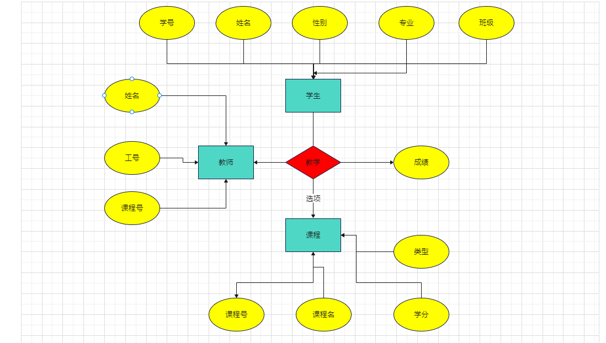

# 实验名：学籍管理系统

## 实验要求：

1.学校有若干**专业**，每个专业每年招若干个**班**，每个班有若干**学生**

2.每个专业有自己的**教学计划**，规定了该专业相关课程的性质（必修或选修）以及授课学期；例如，数据库课程对计算机专业为必修、在大三上学期，但对数学专业可能为选修、在大三下学期，而中文专业可能不学这门课

3.一位**教师**可以给多个班带课，但不能给一个班带多门课

4.一门课程最多允许学生一次补考；学生达到如下条件之一的被开除：不及格必修课累计达10学分、或不及格选修课累计达15学分

5.上述语义未涉及到的事项和细节，可自行做出合理假定

## 功能需求：

建库时应录入一定数量的（不能过少）学生、教师、课程、成绩等基本信息

1.录入一位学生，应包含学号、姓名、性别、出生年月、班级等信息

2.按学号、姓名、专业三种方式查询学生基本信息

3.录入一位学生一门课的成绩

4.查询一位学生所修的课程、性质（必修或选修）、学期、学分及成绩；查询他的必修课平均成绩、所有课程平均成绩（平均成绩应按学分加权）

5.查询一位学生被哪些教师教过课

6.查询快要被开除的学生（距被开除差3学分之内）

## 注意事项

1.在数据库的设计过程中需要运用规范化理论（第六章），避免出现插入/删除异常、数据冗余等问题

2.应设定关系的完整性规则，如实体完整性（例如主码），参照完整性（外码），用户定义的完整性（例如性别只能为“男”或“女”）

3.可以使用索引来加快查询的速度（不强求）

4.可以使用视图来简化系统的设计（不强求）

5.附部分数据示例，可以参考使用；但这些仅是一部分，仍需寻找或构造需要的数据

## ER图



### 1.创建专业表

1.专业代号

2.专业名称

```mysql
create table department(
    Did varchar(255) primary key,
    Dname varchar(255) not null
);
```

### 2. 创建学生表

1.学号

2.姓名

3.性别

4.年龄

5.所在专业

```mysql
create table student(
    Sid varchar(255) primary key,#学号
    Sname varchar(255) not null,#姓名
    Ssex varchar(255) not null,#性别
    Sage int not null,#年龄
    Sdept varchar(255) not null,#所在系
    foreign key(Sdept) references department(Did)#外键
);
```

### 3.创建课程表

1.课程号

2.课程名

3.学分

4.课程类型（必修，选修）

```mysql
create table course(
    Cid varchar(255) primary key,#课程号
    Cname varchar(255) not null,#课程名
    Ccredit int not null,#学分
    Ctype int check ( Ctype in (0, 1) ) not null#课程类型
);
```

### 4.创建教师表

1.教师工号

2.教师姓名

```mysql
create table teacher(
    Tid varchar(255) primary key,#教师号
    Tname varchar(255) not null#姓名
);
```

### 5.创建选课记录表

1.学号

2.课程号

3.任课教师号

4.成绩

5.是否通过

```mysql
create table sc(
    Sid varchar(255) not null,#学号
    Cid varchar(255) not null,#课程号
    Tid varchar(255) not null,#教师号
    Grade int not null,#成绩
    IsPassed int check ( IsPassed in (0, 1) ) not null,#是否通过
    primary key(Sid, Cid),
    foreign key(Sid) references student(Sid),
    foreign key(Cid) references course(Cid)
);
```

### 6.生成选课记录

1.前四张基础信息表由自己获取

2.选课记录为运算生成

```python
import pandas as pd

# 读取 xlsx 文件到 DataFrame
df = pd.read_excel('Data.xlsx', sheet_name='Student')

# 打印 DataFrame 的内容
# print(len(df))
Sid = []
Cid = []
Tid = []
Grade = []
IsPassed = []
for i in range(len(df)):
    sid = df['Sid'][i]
    sdept = df['Sdept'][i]
    for i in range(17):
        Sid.append(sid)
        Cid.append(str(i + 1))
        Tid.append(str(i+6675))
        grade = random.randint(55, 100)
        Grade.append(grade)
        IsPassed.append(1 if grade >= 60 else 0)
    if sdept == 'CS_SE':
        Sid.append(sid)
        Cid.append('18')
        Tid.append('6692')
        grade = random.randint(55, 100)
        Grade.append(grade)
        IsPassed.append(1 if grade>=60 else 0)
    elif sdept == 'CS_AI':
        Sid.append(sid)
        Cid.append('19')
        Tid.append('6693')
        grade = random.randint(55, 100)
        Grade.append(grade)
        IsPassed.append(1 if grade >= 60 else 0)
    elif sdept == 'CS_ES':
        Sid.append(sid)
        Cid.append('20')
        Tid.append('6694')
        grade = random.randint(55, 100)
        Grade.append(grade)
        IsPassed.append(1 if grade >= 60 else 0)
    elif sdept == 'CS_NS':
        Sid.append(sid)
        Cid.append('21')
        Tid.append('6695')
        grade = random.randint(55, 100)
        Grade.append(grade)
        IsPassed.append(1 if grade >= 60 else 0)

data = {'Sid': Sid, 'Cid': Cid, 'Tid': Tid, 'Grade': Grade, 'IsPassed': IsPassed}
df = pd.DataFrame(data)
df.to_excel("SC.xlsx", index=False)
```

### 7.函数代码

#### 1.数据库创建

```mysql
create database if not exists StudentSystemTest;
# select database(StudentSystemTest);
create table department(
    Did varchar(255) primary key,
    Dname varchar(255) not null
);

create table student(
    Sid varchar(255) primary key,#学号
    Sname varchar(255) not null,#姓名
    Ssex varchar(255) not null,#性别
    Sage int not null,#年龄
    Sdept varchar(255) not null,#所在系
    foreign key(Sdept) references department(Did)#外键
);

create table course(
    Cid varchar(255) primary key,#课程号
    Cname varchar(255) not null,#课程名
    Ccredit int not null,#学分
    Ctype int check ( Ctype in (0, 1) ) not null#课程类型
);

create table teacher(
    Tid varchar(255) primary key,#教师号
    Tname varchar(255) not null#姓名
);


create table sc(
    Sid varchar(255) not null,#学号
    Cid varchar(255) not null,#课程号
    Tid varchar(255) not null,#教师号
    Grade int not null,#成绩
    IsPassed int check ( IsPassed in (0, 1) ) not null,#是否通过
    primary key(Sid, Cid),
    foreign key(Sid) references student(Sid),
    foreign key(Cid) references course(Cid)
);
```

#### 2.学生管理系统

```python
from pymysql import Connection
import pandas as pd


def import_init_data():
    try:
        conn = Connection(
            host='localhost',
            port=3306,
            user='root',
            password='123456',
            autocommit=True  # 自动提交事务，不然无法保存新建或者修改的数据
        )
        DataBase = 'StudentSystemTest'
        cursor = conn.cursor()
        conn.select_db(DataBase)
        # 读取 xlsx 文件到 DataFrame
        df = pd.read_excel('Data.xlsx', sheet_name='Course')
        for i in range(len(df)):
            sql = "insert into Course values ('%s','%s','%s','%s')" % (
                df['Cid'][i], df['Cname'][i], df['Ccredit'][i], df['Ctype'][i])
            # print(sql)
            cursor.execute(sql)
        df = pd.read_excel('Data.xlsx', sheet_name='Department')
        for i in range(len(df)):
            sql = "insert into Department values ('%s','%s')" % (df['Did'][i], df['Dname'][i])
            # print(sql)
            cursor.execute(sql)
        df = pd.read_excel('Data.xlsx', sheet_name='Student')
        for i in range(len(df)):
            sql = "insert into Student values ('%s','%s','%s','%s','%s')" % (
                df['Sid'][i], df['Sname'][i], df['Ssex'][i], df['Sage'][i], df['Sdept'][i])
            # print(sql)
            cursor.execute(sql)
        df = pd.read_excel('Data.xlsx', sheet_name='Teacher')
        for i in range(len(df)):
            sql = "insert into Teacher values ('%s','%s')" % (df['Tid'][i], df['Tname'][i])
            # print(sql)
            cursor.execute(sql)
        df = pd.read_excel('Data.xlsx', sheet_name='SC')
        # print(df)
        for i in range(len(df)):
            sql = "insert into SC values ('%s','%s','%s','%s','%s')" % (
                df['Sid'][i], df['Cid'][i], df['Tid'][i], df['Grade'][i], df['IsPassed'][i])
            # print(sql)
            cursor.execute(sql)
    except Exception as e:
        print("error:", e, '初始数据已导入')


def Did_to_Dname(cursor, Did):
    try:
        sql = 'select Dname from Department where Did="%s"' % Did
        cursor.execute(sql)
        result = cursor.fetchall()
        return result[0][0]
    except Exception as e:
        print("error:", e, '该专业不存在')
        return None


def Sid_to_Sname(cursor, Sid):
    try:
        sql = 'select Sname from Student where Sid="%s"' % Sid
        cursor.execute(sql)
        result = cursor.fetchall()
        return result[0][0]
    except Exception as e:
        print("error:", e, '该生不存在')
        return None


# 1.录入一位学生，应包含学号、姓名、性别、出生年月、班级等信息
def add_student(cursor):
    print("录入一位学生，应包含学号、姓名、性别、年龄、专业等信息")
    print("请输入学生信息：")
    Sid = input("学号：")
    Sname = input("姓名：")
    Ssex = input("性别：")
    Sage = input("年龄：")
    Sdept = input("专业：")
    try:
        sql = "insert into Student values ('%s','%s','%s','%s','%s')" % (Sid, Sname, Ssex, Sage, Sdept)
        cursor.execute(sql)
        print("录入成功")
    except Exception as e:
        print("error:", e, '该生已存在')


# 2.按学号、姓名、专业三种方式查询学生基本信息
def query_student(cursor):
    print("按学号、姓名、专业三种方式查询学生基本信息")
    print("请输入查询方式：")
    print("1.按学号查询")
    print("2.按姓名查询")
    print("3.按专业查询")
    user_input = input("请输入您的选择：")
    if user_input == '1':
        Sid = input("请输入学号：")
        try:
            sql = "select * from Student where Sid='%s'" % Sid
            cursor.execute(sql)
            result = cursor.fetchall()
            dname = Did_to_Dname(cursor, result[0][4])
            print('学号：', result[0][0], '姓名：', result[0][1], '性别：', result[0][2], '年龄：', result[0][3], '专业：',
                  dname)
        except Exception as e:
            print("error:", e, '该生不存在')
    elif user_input == '2':
        Sname = input("请输入姓名：")
        try:
            sql = "select * from Student where Sname='%s'" % Sname
            cursor.execute(sql)
            result = cursor.fetchall()
            dname = Did_to_Dname(cursor, result[0][4])
            print('学号：', result[0][0], '姓名：', result[0][1], '性别：', result[0][2], '年龄：', result[0][3], '专业：',
                  dname)
        except Exception as e:
            print("error:", e, '该生不存在')
    elif user_input == '3':
        print("1.CS_SE  2.CS_AI  3.CS_ES  4.CS_NS")
        dept = ['CS_SE', 'CS_AI', 'CS_ES', 'CS_NS']
        SdeptIndex = input("请输入专业：")
        Sdept = dept[int(SdeptIndex) - 1]
        dname = Did_to_Dname(cursor, Sdept)
        try:
            sql = "select * from Student where Sdept='%s'" % Sdept
            cursor.execute(sql)
            result = cursor.fetchall()
            print(dname, ':', end='\n')
            for r in result:
                print('学号：', r[0], '姓名：', r[1], '性别：', r[2], '年龄：', r[3])
        except Exception as e:
            print("error:", e, '该生不存在')
    else:
        print("输入错误")


# 3.录入一位学生一门课的成绩
def add_grade(cursor):
    print("录入一位学生一门课的成绩")
    print("请输入学生信息：")
    Sid = input("学号：")
    Cid = input("课程号：")
    Tid = input("教师号：")
    Grade = input("成绩：")
    IsPassed = 1 if int(Grade) >= 60 else 0
    try:
        sql = "insert into SC values ('%s','%s','%s','%s','%s')" % (Sid, Cid, Tid, Grade, IsPassed)
        cursor.execute(sql)
        print("录入成功")
    except Exception as e:
        print("error:", e, '该生已有该课程成绩')


# 4.查询一位学生所修的课程、性质（必修或选修）、学分及成绩；
def query_student_grade(cursor):
    print("查询一位学生所修的课程、性质（必修或选修）、学分及成绩；"
          "查询他的必修课平均成绩、所有课程平均成绩（平均成绩应按学分加权）")
    print("请输入学生信息：")
    print('1.按学号查询  2.按姓名查询')
    user_input = input("请输入您的选择：")
    if user_input == '1':
        Sid = input("学号：")
    elif user_input == '2':
        Sname = input("姓名：")
        Sid = Sid_to_Sname(cursor, Sname)
    try:
        sql = "select Sid,Cname,Ctype,Ccredit,Grade from SC,course where Sid='%s' and SC.Cid=course.Cid" % Sid
        cursor.execute(sql)
        result = cursor.fetchall()
        required_course_grade = 0
        required_course_credit = 0
        all_course_grade = 0
        all_course_credit = 0
        for r in result:
            print('课程名：', r[1], '性质：', '必修' if r[2] == 1 else '选修', '学分：', r[3], '成绩：', r[4])
            if r[2] == 1:
                required_course_grade += r[3] * r[4]
                required_course_credit += r[3]
            all_course_grade += r[3] * r[4]
            all_course_credit += r[3]
        print('必修课平均成绩：%.2f' % (required_course_grade / required_course_credit))
        print('所有课程平均成绩：%.2f' % (all_course_grade / all_course_credit))
    except Exception as e:
        print("error:", e, '该生成绩异常')


# 5.查询一位学生被哪些教师教过课
def query_student_teacher(cursor):
    print("查询一位学生被哪些教师教过课")
    print("请输入学生信息：")
    Sid = input("学号：")
    try:
        sql = "select Tname ,Cname from SC,Teacher,course where Sid='%s' and SC.Tid=Teacher.Tid and SC.Cid=course.Cid" % Sid
        cursor.execute(sql)
        result = cursor.fetchall()
        for r in result:
            # print('教师名：%-*s' % r[0], '课程名：%s'% r[1])
            print("教师名：%-*s 课程名：%s" % (12 - len(r[0]), r[0], r[1]))
    except Exception as e:
        print("error:", e, '该生数据异常')


# 6.查询快要被开除的学生（距被开除差3学分之内）学生达到如下条件之一的被开除：不及格必修课累计达10学分、或不及格选修课累计达15学分
def query_all_student_is_expelled(cursor):
    print("查询快要被开除的学生（距被开除差3学分之内）")
    try:
        sql = 'select Student.Sid,Student.Sname,' \
              'sum(case when course.Ctype=0 and sc.IsPassed=0 then course.Ccredit else 0 end) as failing_elective_course_credit,' \
              'sum(case when course.Ctype=1 and sc.IsPassed=0 then course.Ccredit else 0 end) as failing_required_course_credit ' \
              'from SC,course,Student where SC.Cid=course.Cid and SC.Sid=Student.Sid group by Sid '
        cursor.execute(sql)
        result = cursor.fetchall()
        for r in result:
            if r[3] > 10 or r[2] > 15:
                print('学号：', r[0], '姓名：', r[1], end=' ')
                print("已开除")
            elif 10 >= r[3] >= 7 or 15 >= r[2] >= 12:
                print('学号：', r[0], '姓名：', r[1], end=' ')
                print("快要被开除")
            else:
                pass
                # print('学号：', r[0], '姓名：', r[1], end=' ')
                # print("没有被开除")
    except Exception as e:
        print("error:", e, '该生成绩异常')


# 7.查询一位学生是否被开除；
def query_student_is_expelled(cursor):
    print("请输入学生信息：")
    print('1.按学号查询  2.按姓名查询')
    user_input = input("请输入您的选择：")
    if user_input == '1':
        Sid = input("学号：")
    elif user_input == '2':
        Sname = input("姓名：")
        Sid = Sid_to_Sname(cursor, Sname)
    else:
        print("输入错误")
        return
    try:
        sql = "select Sid,Cname,Ctype,Ccredit,Grade from SC,course where Sid='%s' and SC.Cid=course.Cid" % Sid
        cursor.execute(sql)
        result = cursor.fetchall()
        failing_elective_course_credit = 0
        failing_required_course_credit = 0
        for r in result:
            if r[2] == 1 and r[4] < 60:
                failing_required_course_credit += r[3]
            elif r[2] == 0 and r[4] < 60:
                failing_elective_course_credit += r[3]
        if failing_required_course_credit > 10 or failing_elective_course_credit > 15:
            print("该生已被开除")
        elif 10 >= failing_required_course_credit >= 7 or 15 >= failing_elective_course_credit >= 12:
            print("该生快要被开除")
        else:
            print("该生没有被开除")
    except Exception as e:
        print("error:", e, '该生成绩异常')


# 界面
def UI():
    print("---------------------------------")
    print("欢迎使用学生管理系统")
    print("1.录入一位学生，应包含学号、姓名、性别、出生年月、班级等信息")
    print("2.按学号、姓名、专业三种方式查询学生基本信息")
    print("3.录入一位学生一门课的成绩")
    print("4.查询一位学生所修的课程、性质（必修或选修）、学期、学分及成绩；"
          "查询他的必修课平均成绩、所有课程平均成绩（平均成绩应按学分加权）")
    print("5.查询一位学生被哪些教师教过课")
    print("6.查询快要被开除的学生（距被开除差3学分之内）")
    print("7.查询一位学生是否被开除；")
    print('0.退出')
    print("----------------------------------")


if __name__ == '__main__':
    # import_init_data()
    conn = Connection(
        host='localhost',  # 用户
        port=3306,  # 端口号
        user='root',  # 用户名
        password='123456',  # 密码
        autocommit=True  # 自动提交事务，不然无法保存新建或者修改的数据
    )
    DataBase = 'StudentSystemTest'
    cursor = conn.cursor()
    conn.select_db(DataBase)
    while True:
        UI()
        user_input = input("请输入您的选择：")
        if user_input == '1':
            add_student(cursor)
        elif user_input == '2':
            query_student(cursor)
        elif user_input == '3':
            add_grade(cursor)
        elif user_input == '4':
            query_student_grade(cursor)
        elif user_input == '5':
            query_student_teacher(cursor)
        elif user_input == '6':
            query_all_student_is_expelled(cursor)
        elif user_input == '7':
            query_student_is_expelled(cursor)
        elif user_input == '0':
            break
        else:
            print("输入错误")
    conn.close()

```


